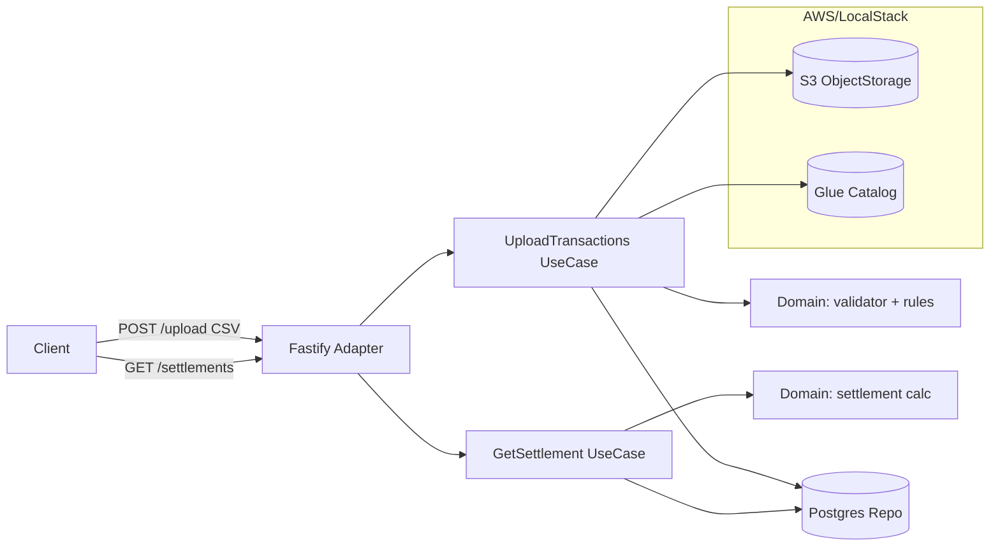

# FinCard — Servicio de Liquidación de Puntos de Lealtad

Servicio backend que procesa transacciones de puntos de lealtad de aliados comerciales
(cadenas, restaurantes, tiendas), aplica reglas de negocio de validación/anti-fraude y
expone liquidaciones (settlements) por aliado y rango de fechas para el cálculo de lo
que FinCard debe pagar/cobrar a cada aliado.

El servicio recibe archivos CSV con transacciones vía HTTP, los valida y normaliza,
guarda el dato crudo en un data lake (S3 + Glue Data Catalog) y guarda una copia
consultable en Postgres para servir las liquidaciones de forma eficiente.

## Tabla de contenido

- [Stack tecnológico](#stack-tecnológico)
- [Arquitectura](#arquitectura)
- [Prerrequisitos](#prerrequisitos)
- [Cómo correr el proyecto localmente](#cómo-correr-el-proyecto-localmente)
- [Endpoints de la API](#endpoints-de-la-api)
- [Pruebas](#pruebas)
- [Build](#build)
- [Despliegue en AWS (IaC)](#despliegue-en-aws-iac)
- [Supuestos documentados](#supuestos-documentados)
- [Documentación adicional](#documentación-adicional)

## Stack tecnológico

| Capa | Tecnología |
|---|---|
| Runtime | Node.js 20+, TypeScript (ESM) |
| HTTP framework | Fastify 5 (`@fastify/multipart`, `@fastify/helmet`, `@fastify/rate-limit`) |
| Validación | Zod |
| Parseo de CSV | `csv-parse` |
| Query store | Postgres 16 + Kysely (query builder tipado) + `pg` |
| Data lake | AWS S3 (objetos NDJSON) |
| Catálogo de datos | AWS Glue Data Catalog (prod) / catálogo local en JSON (dev, ver ADR-0003) |
| Emulación local de AWS | LocalStack 3 (`s3`) |
| Testing | Vitest (unitarias) + Testcontainers (integración, Postgres real vía Docker) |
| Infraestructura | Docker Compose (desarrollo local); Terraform (IaC, entregado en una fase posterior) |

## Arquitectura

El proyecto sigue **arquitectura hexagonal (ports & adapters)**. El dominio y los
casos de uso no conocen Fastify, S3, Glue ni Postgres — dependen solo de interfaces
(*ports*) definidas por la propia aplicación. Ver justificación completa en
[DESIGN.md](./DESIGN.md) y en [docs/adr/0001-hexagonal-architecture.md](./docs/adr/0001-hexagonal-architecture.md).



**Flujo de subida (`UploadTransactions`)**: el adaptador HTTP recibe el CSV
`multipart/form-data` → el caso de uso parsea el CSV, valida cada fila (`field-validator`)
y aplica las reglas de negocio RN-01..RN-04 (`business-rules`) → las filas limpias se
escriben en S3 particionadas por `{year}/{month}/{partner_id}` como NDJSON, se registra
un manifiesto en `manifests/`, se registra/actualiza la tabla en el catálogo de datos
(Glue en producción; un catálogo local en JSON en desarrollo, ver ADR-0003), y se
persisten en Postgres (`transactions` para las limpias, `transactions_flagged` para las
marcadas).

**Flujo de liquidación (`GetSettlement`)**: el adaptador HTTP recibe `partnerId` +
rango de fechas → el caso de uso consulta Postgres (no S3) para agregar totales y el
desglose diario, y aplica la regla de neto no-negativo hacia afuera.

## Prerrequisitos

- Node.js >= 20
- Docker y Docker Compose (para Postgres + LocalStack, y para las pruebas de integración con Testcontainers)
- npm

## Cómo correr el proyecto localmente

```bash
# 1. Levantar Postgres + LocalStack (S3 emulado; Glue no está disponible en la edición
#    community de LocalStack, ver más abajo)
docker compose up -d

# 2. Copiar variables de entorno
cp .env.example .env

# 3. Instalar dependencias
npm ci

# 4. Levantar el servicio en modo desarrollo (las migraciones de Postgres corren al iniciar)
npm run dev
```

El servicio queda escuchando en `http://localhost:3000` (configurable con `PORT` en `.env`).

Variables relevantes de `.env.example`:

| Variable | Descripción |
|---|---|
| `DATABASE_URL` | Cadena de conexión a Postgres |
| `AWS_REGION`, `AWS_ACCESS_KEY_ID`, `AWS_SECRET_ACCESS_KEY` | Credenciales AWS (dummy `test`/`test` para LocalStack) |
| `AWS_ENDPOINT_URL` | `http://localhost:4566` en desarrollo (LocalStack); se omite/apunta a AWS real en producción |
| `S3_BUCKET`, `GLUE_DATABASE`, `GLUE_TABLE` | Recursos del data lake |
| `CATALOG_MODE` | `file` (default) usa un catálogo local en JSON (emulador de Glue para desarrollo, ya que Glue es una feature de LocalStack Pro); `glue` usa el SDK real de AWS Glue (producción / LocalStack Pro / AWS real) |
| `CATALOG_FILE` | Ruta del archivo JSON del catálogo local cuando `CATALOG_MODE=file` (default `./data/catalog/catalog.json`) |
| `MAX_UPLOAD_BYTES` | Límite de tamaño del CSV subido (bytes) |

## Endpoints de la API

### `POST /api/v1/transactions/upload`

Sube un CSV de transacciones (campo multipart `file`). Valida cada fila, aplica las
reglas de negocio anti-fraude, persiste en S3 + Glue + Postgres, y devuelve un
manifiesto del lote procesado.

```bash
curl -X POST http://localhost:3000/api/v1/transactions/upload \
  -F "file=@data/samples/transactions.csv"
```

Respuesta `201 Created` (ejemplo abreviado):

```json
{
  "batchId": "b1f0...-uuid",
  "validRows": 42,
  "rejectedRows": 3,
  "flaggedRows": 2,
  "errors": [{ "row": 4, "field": "member_id", "value": "MEM01", "message": "..." }],
  "processedAt": "2026-07-01T12:00:00.000Z",
  "sourceSha256": "...",
  "s3Prefixes": ["2026/07/PART01"]
}
```

Si todas las filas son inválidas responde `400 VALIDATION_FAILED`. Si falta el archivo
responde `422 INVALID_PARAMS`.

### `GET /api/v1/settlements/:partnerId?from=YYYY-MM-DD&to=YYYY-MM-DD`

Devuelve la liquidación (resumen + desglose diario) de un aliado en un rango de fechas.

```bash
curl "http://localhost:3000/api/v1/settlements/PART01?from=2026-07-01&to=2026-07-31"
```

Respuesta `200 OK` (ejemplo abreviado):

```json
{
  "partner_id": "PART01",
  "partner_name": "Café Central",
  "period": { "from": "2026-07-01", "to": "2026-07-31" },
  "summary": {
    "total_transactions": 10,
    "total_points_earned": 1500,
    "total_points_redeemed": 200,
    "net_points_owed": 1300,
    "unique_members": 4
  },
  "daily_breakdown": [
    { "date": "2026-07-01", "transactions": 2, "points_earned": 450, "points_redeemed": 0 }
  ]
}
```

Si el aliado no existe responde `404 NOT_FOUND`. Si los parámetros son inválidos
(fechas mal formadas, `from` > `to`, etc.) responde `422 INVALID_PARAMS`.

### `GET /health`

Health check simple: `{ "status": "ok" }`.

## Pruebas

```bash
# Unitarias (dominio + aplicación, sin dependencias externas)
npm test

# Integración (requiere Docker corriendo — usa Testcontainers para levantar
# Postgres y S3 (LocalStack) reales y validar repositorios/adaptadores/migraciones)
# La suite de GlueCatalog se omite por defecto (Glue no existe en LocalStack community);
# para correrla contra LocalStack Pro o AWS real: RUN_GLUE_IT=1 npm run test:int
npm run test:int

# Cobertura
npm run coverage
```

## Build

```bash
npm run build   # compila a dist/ con tsc
npm start        # corre el build compilado (node dist/main.js)
npm run typecheck
npm run lint
```

## Despliegue en AWS (IaC)

La infraestructura de despliegue está **completa y validada como código** en
[`terraform/`](./terraform) (`terraform validate` y `terraform fmt` pasan). Provisiona
ECS Fargate detrás de un ALB, RDS Postgres 16, S3, ECR, VPC con subredes públicas/privadas,
IAM *least-privilege* y credenciales en Secrets Manager. Los pasos de despliegue están en
[`terraform/README.md`](./terraform/README.md).

> **Nota:** El despliegue en vivo **no se dejó ejecutado a propósito, por costo.** Levantar
> este stack incurre en cargos continuos de AWS (NAT Gateway, ALB, RDS y Fargate ≈ **$70–80
> USD/mes** si se deja encendido). La solución **queda lista para desplegar**: basta con tener
> credenciales de AWS configuradas (`aws configure` / SSO) y ejecutar el flujo documentado.

Resumen del flujo (detalle en [`terraform/README.md`](./terraform/README.md)):

```bash
cd terraform
export TF_VAR_db_password="<contraseña-fuerte>"
terraform init && terraform apply                 # crea VPC, ECR, S3, RDS, ECS+ALB

ECR_URL=$(terraform output -raw ecr_repository_url)
aws ecr get-login-password --region us-east-1 | docker login --username AWS --password-stdin "${ECR_URL%/*}"
docker build -t "$ECR_URL:latest" .. && docker push "$ECR_URL:latest"
aws ecs update-service --cluster fincard-cluster --service fincard-app --force-new-deployment

curl "http://$(terraform output -raw alb_dns_name)/health"   # URL pública desplegada

terraform destroy                                 # ⚠️ ejecutar al terminar para no seguir pagando
```

En producción, la app usa S3 y Glue **reales** (sin LocalStack): se establece
`CATALOG_MODE=glue` y no se define `AWS_ENDPOINT_URL`, por lo que los mismos adaptadores del
SDK apuntan a los servicios reales de AWS.

## Supuestos documentados

1. **Athena y Redshift como entregable SQL, no como backend en vivo.** El enunciado
   pide *escribir* las consultas de optimización para Athena/Redshift sobre un dataset
   de 500M+ filas; ese entregable vive en [`queries/optimization.sql`](./queries/optimization.sql).
   El backend real que corre en este repo usa S3 + Glue Data Catalog + Postgres como
   motor de lectura, consistente con la narrativa de "S3 es la fuente cruda, Athena/Glue
   catalogan, y una capa de servicio expone los datos ya agregados". Ver
   [ADR-0002](./docs/adr/0002-postgres-query-store.md).
2. **Postgres como query store para RF-04/RF-05.** Las consultas de rango y agregación
   por aliado que expone `GET /api/v1/settlements/:partnerId`, así como el registro de
   transacciones marcadas (`transactions_flagged`), se sirven desde Postgres en vez de
   consultar S3/Athena en cada request. S3 sigue siendo el data lake de datos crudos.
   Justificación completa en [ADR-0002](./docs/adr/0002-postgres-query-store.md).
3. **Interpretación de RN-01 (límite diario de 10,000 puntos netos por miembro).**
   Se ordenan las transacciones del mismo miembro/día por `transaction_id` y se acumula
   el neto (`points_earned - points_redeemed`). En el momento en que el neto acumulado
   *supera* 10,000, esa transacción y **todas** las transacciones subsecuentes del mismo
   día quedan marcadas como "sujeta a revisión" — lectura literal de "no puede acumular
   más de 10,000 puntos netos en un día", incluso si una redención posterior hiciera
   bajar el neto de nuevo por debajo del límite.
4. **Formato de almacenamiento en S3: NDJSON.** El objetivo documentado para la capa de
   analítica/Athena es Parquet (columnar, comprimido, con partition pruning — ver
   `queries/optimization.sql`), pero la ruta en vivo emulada localmente (LocalStack)
   escribe NDJSON para mantener el stack local simple y robusto sin una dependencia de
   escritura Parquet en el camino caliente. Ver [ADR-0003](./docs/adr/0003-localstack-and-aws-sdk-adapters.md).
5. **`net_points_owed` negativo se reporta como 0 hacia afuera.** Si un aliado redimió
   más puntos de los que generó en el período (neto negativo), la API externa
   (`GET /api/v1/settlements/...`) siempre devuelve `net_points_owed >= 0`; el valor real
   (negativo) se mantiene internamente disponible vía la suma de
   `total_points_earned - total_points_redeemed` en el mismo payload, para no ocultar la
   información pero sí evitar que FinCard "le deba puntos negativos" a un aliado.

### Limitaciones conocidas

1. **La tabla `transactions` del catálogo está registrada solo con columnas** (sin
   `PartitionKeys`, `Location` ni `SerDe`), por lo que cataloga el esquema pero no queda
   cableada para consultas en vivo de Athena sobre el data lake NDJSON. La Query 2 de
   [`queries/optimization.sql`](./queries/optimization.sql) apunta a una tabla de
   analítica separada (`transactions_parquet`) que representa la capa analítica prevista
   a futuro. El registro completo de particiones queda fuera de alcance para este
   ejercicio de 2 días. Esto aplica tanto al catálogo real (Glue, `CATALOG_MODE=glue`)
   como a su emulación local (`CATALOG_MODE=file`, ver ADR-0003).
2. **La existencia de aliado/miembro no se valida en el upload**, solo se valida el
   formato vía regex. Un `partner_id` bien formado pero inexistente (por ejemplo,
   `PART99`) se almacena sin error y recién devuelve 404 al momento de consultar la
   liquidación (`GET /api/v1/settlements/:partnerId`).
3. **`partner_name` se toma tal cual viene en el CSV**, no se resuelve contra el seed de
   `partners`, por lo que puede diferir del nombre que sí se resuelve desde el seed en el
   encabezado de la respuesta de liquidación.

## Documentación adicional

- [DESIGN.md](./DESIGN.md) — capas, pipeline ETL, modelo de datos, reglas de negocio, manejo de errores, estrategia de pruebas.
- [docs/adr/0001-hexagonal-architecture.md](./docs/adr/0001-hexagonal-architecture.md)
- [docs/adr/0002-postgres-query-store.md](./docs/adr/0002-postgres-query-store.md)
- [docs/adr/0003-localstack-and-aws-sdk-adapters.md](./docs/adr/0003-localstack-and-aws-sdk-adapters.md)
